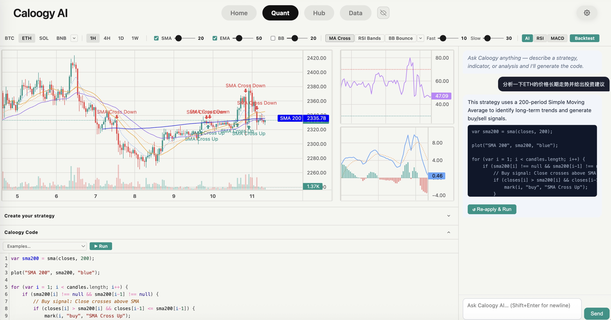
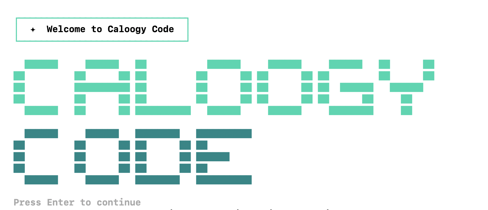

# Caloogy Code

Local crypto quant analysis tool — the same charting and AI code editor as [caloogy.com](https://caloogy.com), running entirely on your machine with your own AI API key.



---

## Quick Start

No install required — run directly with npx:

```bash
npx github:iamtheozzz/caloogy_code
```



On first run you'll be prompted to choose an AI provider and paste your API key. The browser opens automatically at `http://localhost:3000`.

---

## Installation

### One-time run (no install)

```bash
npx github:iamtheozzz/caloogy_code
```

### Global install — type `caloogy` from anywhere

**macOS / Linux**
```bash
npm install -g github:iamtheozzz/caloogy_code
caloogy
```

**Windows (PowerShell)**
```powershell
npm install -g github:iamtheozzz/caloogy_code
caloogy
```

**Windows (Command Prompt)**
```cmd
npm install -g github:iamtheozzz/caloogy_code
caloogy
```

### Uninstall

```bash
npm uninstall -g caloogy-code
```

---

## Requirements

| Requirement | Version |
|-------------|---------|
| Node.js | 18 or later |
| npm | 7 or later (bundled with Node.js) |
| AI API key | One of: Gemini, OpenAI, or Claude |

Download Node.js: [nodejs.org](https://nodejs.org)

---

## Supported AI Providers

| Provider | Where to get a key |
|----------|--------------------|
| **Google Gemini** *(free tier available)* | [aistudio.google.com/app/apikey](https://aistudio.google.com/app/apikey) |
| **OpenAI** | [platform.openai.com/api-keys](https://platform.openai.com/api-keys) |
| **Anthropic Claude** | [console.anthropic.com/settings/keys](https://console.anthropic.com/settings/keys) |

> **Cost:** Caloogy Code is completely free and open source. You only pay for the AI API calls you make — Gemini offers a generous free tier that is sufficient for most users.

---

## Usage

### Starting the app

```bash
caloogy
```

The browser opens automatically at `http://localhost:3000`. Press `Ctrl+C` in the terminal to stop the server.

### Changing your AI provider or API key

```bash
caloogy --reconfigure
# or
caloogy -r
```

### Flags

| Flag | Description |
|------|-------------|
| `--reconfigure`, `-r` | Re-run setup to change provider or API key |

---

## Features

- **Live candlestick charts** — BTC, ETH, SOL, BNB and 29 more coins, powered by OKX & Binance public APIs
- **Timeframes** — 1H, 4H, 1D, 1W
- **Built-in indicators** — SMA, EMA, Bollinger Bands, RSI, MACD (open by default)
- **19 backtest strategies** — MA Cross, RSI Bands, BB Bounce, Supertrend, Ichimoku, Donchian, Stochastic, and more
- **Strategy builder** — answer a few questions, get an AI-generated investment analysis in plain English
- **Caloogy Code editor** — write custom JavaScript indicators and run them live on the chart
- **AI chat** — describe any strategy in plain English → AI writes the code and runs it instantly
- **Light / dark mode** toggle
- **Auto coin switching** — mention ETH or SOL in your AI prompt and the chart switches automatically

---

## Privacy

- Market data is fetched directly from OKX / Binance — no data passes through any third-party server
- Your API key is stored only in `~/.caloogy-config.json` on your own machine
- AI requests go directly from your machine to the provider's API (Google / OpenAI / Anthropic)
- No analytics, no telemetry, no accounts required

---

## Troubleshooting

**Port already in use** — Caloogy Code automatically finds the next available port starting from 3000.

**`caloogy` command not found after global install** — make sure npm's global bin directory is in your PATH:
```bash
# macOS / Linux — add to ~/.zshrc or ~/.bashrc
export PATH="$(npm prefix -g)/bin:$PATH"
```

**AI error / model not found** — run `caloogy --reconfigure` to switch to a different model or provider.

**Browser doesn't open automatically** — navigate manually to the URL printed in the terminal (e.g. `http://localhost:3000`).

---

## License

MIT © [Caloogy](https://caloogy.com)
